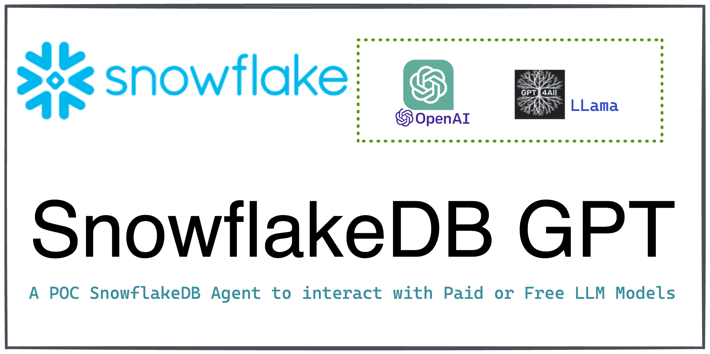

# ❄️ Snowflake GPT Agent: GPT for Running Snowflake Query - Demo



Powered by [langchain](https://python.langchain.com/en/latest/index.html), [GPT4All](https://gpt4all.io/index.html) and inspired by [privategpt](https://github.com/imartinez/privateGPT)

## 💾 Installation

1. Navigate to the directory where the repository was downloaded

    ```bash
    cd snowflakegpt
    ```
2. Install the required dependencies

    ```bash
    pip install -r requirements.txt
    ```

3. Configure OpenAI Key
    * If Using OpenAI key, simply `export OPENAI_API_KEY=*****`
    * If want to use config file, rename `config_template.ini` -> `config.ini` file inside the `snowdflakegpt` dir & update either Azure or OpenAI config

    By completing these steps, you have properly configured the API Keys for your project.


## Pick the Model

Add the model details in config.ini
```
[model]
MODEL_TYPE=azure/openai/LlamaCpp/GPT4All #supports LlamaCpp or GPT4All as well
LLAMA_EMBEDDINGS_MODEL=/path/to/ggml-model-q4_0.bin #Path to your GPT4All or LlamaCpp supported LLM
MODEL_PATH=/path/to/ggml-gpt4all-j-v1.3-groovy.bin #Path to your LlamaCpp supported embeddings model
```

## Uploading Data in Vector Database

1. Run docker compose up
2. Run `python -m snowgpt upload`

## 🔧 Usage

1. Run `snowdflakegpt` Python module in your terminal with default GPT model

```
python -m snowgpt "What is the population of India?"
```

2. Run the agent by passing specific model.

```
python -m snowgpt "How many women between the ages 39 and 45 in India" gpt-4_8k_ascent
```

Current supported list of deployment names are
* gpt-35-turbo
* gpt-4_8k_ascent
* gpt-4_32k_ascent

Default is `gpt-35-turbo`

## 🚒 Improvements / TODO

### LLM Chains
Maybe a sequential chain to have an intermediate function to validate the query and make corrections

### Custom Agent
Creating a Custom Agent to control the query generation. This may need a custom Agent & custom Tools .